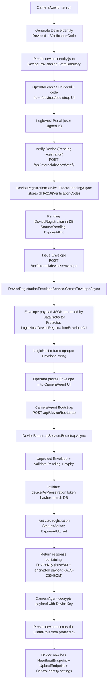

# CameraAgent Overview Review (Dec 18, 2025)

This document captures the current CameraAgent flow and the integration points with LogicHost:

1. Device registration + bootstrap flow (operator-assisted)
2. CameraAgent background services and startup wiring
3. Capture → processing → upload pipeline (current implementation vs intended)

---

## 1) Device Registration & Bootstrap Flow (CameraAgent ⇄ LogicHost)

### High-level narrative

- On first run, the CameraAgent generates a **DeviceId** and **VerificationCode** and stores them locally.
- An operator uses LogicHost (portal UI) to verify that identity against an observatory, creating a **Pending** device registration.
- LogicHost issues a **single-use encrypted envelope** that contains per-device secrets.
- The operator pastes the envelope into the CameraAgent UI.
- CameraAgent calls LogicHost bootstrap endpoint, receives an encrypted payload, decrypts it using the **DeviceKey**, and stores **device secrets** locally.
- The stored secrets include the **heartbeat** and **upload** endpoints and Central Identity wiring that CameraAgent can inherit.

### Flowchart

If the Mermaid block below does not render in VS Code preview, use this rendered diagram:

### Concrete API endpoints (current)

- LogicHost internal device registration APIs:
  - `POST /api/internal/devices/verify`
  - `POST /api/internal/devices/envelope`
  - `POST /api/internal/devices/delete`
- LogicHost device bootstrap API:
  - `POST /api/device/bootstrap`

### Key artifacts

- **Device identity** (created by CameraAgent)
  - Fields: `DeviceId`, `VerificationCode`, `CreatedUtc`
  - Persisted as JSON on disk.
- **Envelope** (issued by LogicHost)
  - Opaque protected string created with ASP.NET Data Protection.
  - Contains per-device secrets (including a base64 256-bit `DeviceKey`) and is time-bounded.
- **Device secrets** (stored by CameraAgent after bootstrap)
  - Fields: `DevicePublicId`, `ObservatoryId`, `FriendlyName`, `RegistrationToken`, `HeartbeatEndpoint`, `UploadEndpoint`, expiry, etc.
  - Persisted on disk as a **DataProtection-protected** blob.

---

## 2) CameraAgent background services (startup wiring)

The CameraAgent host registers and starts the capture/retention services via:

- `builder.Services.AddCameraAgentInfrastructure(builder.Configuration);`

That extension method wires:

- Configuration accessor + loader
- Module factory
- Telemetry sink/metrics
- Capture processing pipeline factory
- **Hosted services:**
  - `CameraAgentConfigurationInitializer`
  - `CameraCaptureService`
  - `RetentionBackgroundService`

### Background services and their roles

1. `CameraAgentConfigurationInitializer` (IHostedService)
   - Loads the camera agent config file and sets it into the accessor.
   - This “unblocks” downstream hosted services that `await WaitForConfigurationAsync(...)`.

2. `CameraCaptureService` (BackgroundService)
   - Waits for configuration.
   - Creates camera module instance by module type.
   - Starts frame processing worker (channel + ordered processing steps).
   - Runs the module capture loop.
   - Restarts on transient failures (5-second backoff).

3. `RetentionBackgroundService` (BackgroundService)
   - Waits for configuration.
   - Periodically prunes storage roots referenced by configured file-storage processing steps.
   - Sweep interval comes from `CameraAgent:RetentionSweepIntervalMinutes`.

---

## 3) Capture → processing → upload pipeline

### Runtime shape

If the Mermaid block below does not render in VS Code preview, use this rendered diagram:

```mermaid
flowchart LR
  A["CameraCaptureService"] --> B["Create ICameraModule from ModuleType"]
  B --> C["CameraModuleRunner loop"]
  C --> D["ICameraModule.CaptureAsync"]
  D --> E["CaptureResult (Frame + NextSetpoint + flags)"]
  E --> F["Publish CaptureLoopSubmission"]
  F --> G["FrameProcessingChannel"]
  G --> H["FrameProcessingWorker"]
  H --> I["CaptureProcessingPipelineFactory.CreatePipeline"]
  I --> J["Process steps in order"]
```

### What drives processing steps

- Steps are sourced from the camera agent config file (e.g. `cameraagent.sample.json`) under `processingSteps`.
- `CaptureProcessingPipelineFactory` resolves each step by type/alias and instantiates it via DI.

### Current steps in `cameraagent.sample.json`

The sample config currently includes:

- `CalibrationCaptureProcessingStep`
- `NoOpFileStorageProcessingStep` (twice: different storage roots)
- `NoOpUploadProcessingStep`
- `TelemetryCaptureProcessingStep`

### How “latest frame” is surfaced

- `NoOpFileStorageProcessingStepOptions.UpdateLatestFrame = true` updates `ILatestFrameAccessor`.
- The CameraAgent API endpoint `/api/v1.0/frames/latest` encodes the latest frame snapshot to JPEG.
  - Only `Mono8` frames are currently preview-supported.

### LogicHost upload endpoint (server side)

LogicHost exposes a device upload endpoint:

- `POST /api/device/upload`
  - Validates device credentials against active registrations.
  - Currently records a stub storage reference (no real persistence yet).

### Important gaps (current state)

- CameraAgent does **not** currently upload frames to LogicHost.
  - The “upload” step is explicitly a **NoOp**.
- CameraAgent does **not** currently send periodic heartbeats to LogicHost.
  - LogicHost endpoint exists (`POST /api/device/heartbeat`) and the bootstrap payload includes a HeartbeatEndpoint, but nothing consumes it yet.
- Frame storage also appears **stubbed in the pipeline**:
  - `FileSystemFrameStorageService` exists, but the configured pipeline uses `NoOpFileStorageProcessingStep`, which logs + optionally updates latest frame.

---

## Appendix: Key implementation files

Registration & bootstrap:

- CameraAgent identity + secrets:
  - `src/HVO.SkyMonitor.CameraAgent/Services/DeviceIdentityStore.cs`
  - `src/HVO.SkyMonitor.CameraAgent/Services/DeviceSecretStore.cs`
  - `src/HVO.SkyMonitor.CameraAgent/Services/DeviceBootstrapWorkflow.cs`
- LogicHost registration + envelope + bootstrap:
  - `src/HVO.SkyMonitor.LogicHost/Controllers/DeviceRegistrationsController.cs`
  - `src/HVO.SkyMonitor.LogicHost/Services/DeviceRegistrationService.cs`
  - `src/HVO.SkyMonitor.LogicHost/Services/DeviceRegistrationEnvelopeService.cs`
  - `src/HVO.SkyMonitor.LogicHost/Controllers/DeviceBootstrapController.cs`
  - `src/HVO.SkyMonitor.LogicHost/Services/DeviceBootstrapService.cs`

Background services + pipeline:

- Wiring:
  - `src/HVO.SkyMonitor.CameraAgent/Program.cs`
  - `src/HVO.SkyMonitor.CameraAgent.Common/DependencyInjection/CameraAgentServiceCollectionExtensions.cs`
- Services:
  - `src/HVO.SkyMonitor.CameraAgent.Common/Configuration/CameraAgentConfigurationInitializer.cs`
  - `src/HVO.SkyMonitor.CameraAgent.Common/Capture/CameraCaptureService.cs`
  - `src/HVO.SkyMonitor.CameraAgent.Common/Background/RetentionBackgroundService.cs`
- Pipeline primitives:
  - `src/HVO.SkyMonitor.CameraAgent.Common/Capture/CameraModuleRunner.cs`
  - `src/HVO.SkyMonitor.CameraAgent.Common/Capture/FrameProcessingWorker.cs`
  - `src/HVO.SkyMonitor.CameraAgent.Common/Capture/Processing/CaptureProcessingPipelineFactory.cs`
- Frames API:
  - `src/HVO.SkyMonitor.CameraAgent/Controllers/v1/FramesController.cs`

LogicHost device upload:

- `src/HVO.SkyMonitor.LogicHost/Controllers/DeviceUploadController.cs`
- `src/HVO.SkyMonitor.LogicHost/Services/DeviceUploadService.cs`
