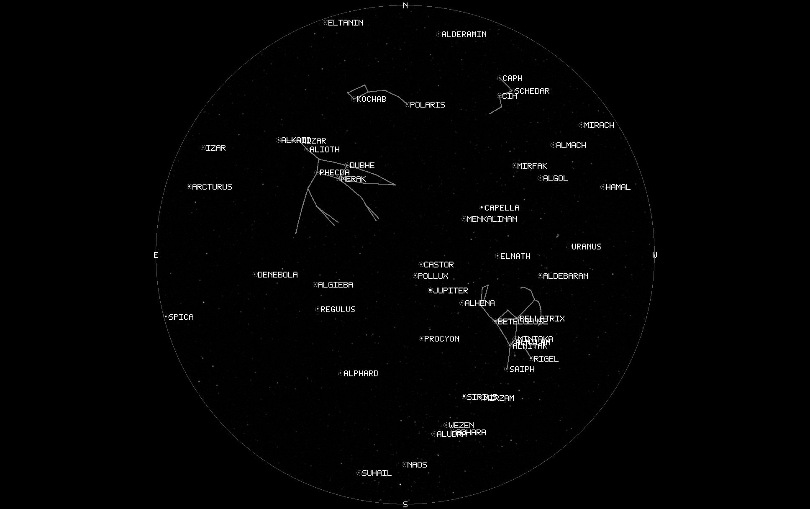
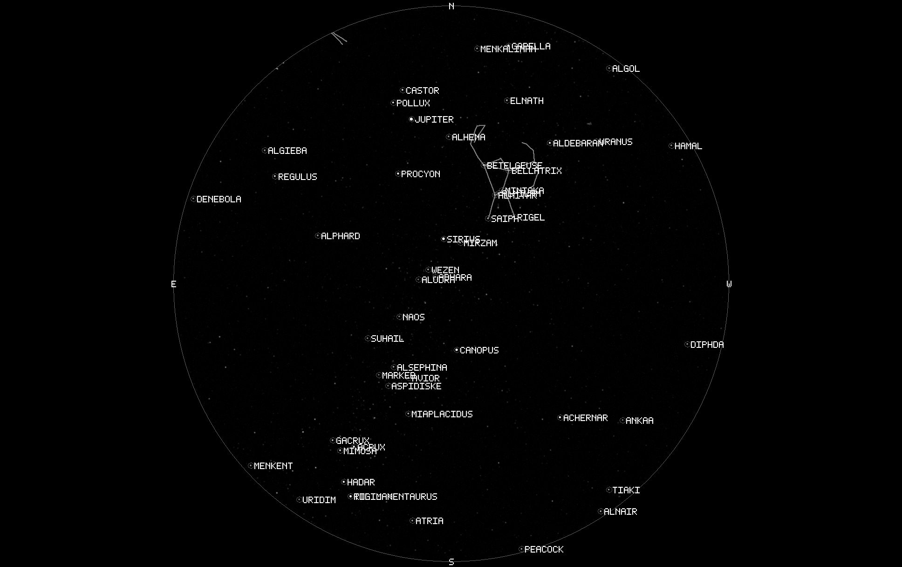

# Dual Standalone CameraAgent Validation

Issue [#197](https://github.com/RoySalisbury/HVO.SkyMonitor/issues/197)
validates two concurrent full-resolution standalone CameraAgents built from one
content-addressed image. Hualapai and explicitly synthetic Siding Spring use
separate Compose projects, network namespaces, identities, owner secrets,
cookies, writable roots, production-catalog copies, Data Protection keys,
durable journals, processing stores, and telemetry collectors. LogicHost and
all shared central services are absent.

## Retained Images

The reviewed deterministic images are 1936x1216 Mono8 JPEG previews decoded
from each agent's final annotated artifact. Hualapai retains the #171 fixed
scene and Siding Spring uses seed `197` at `2026-01-15T13:00:00Z` with the
synthetic location fixture.

- Hualapai SHA-256: `E859398445752A20EED0EBCFFF4E5F624EDE523F7416B81A881FA88F6E10171C`
- Synthetic Siding Spring SHA-256: `767AB36B95BCDAF609CE2C50DFBBDA4DF3A1483E5D60B6B5C5BBBDB6A0524350`





## Reproduction

```bash
HVO_CATALOG_PERF_ROOT=/var/lib/hvo/skymonitor/catalogs/hyg-v42-production \
HVO_OTEL_COLLECTOR_IMAGE=otel/opentelemetry-collector-contrib@sha256:f2f01157055a9b2aab9df7118e1f1c9abf345e99b23bc7a2bc791db374a7d0f6 \
  ./scripts/test:cameraagent-dual-standalone-smoke
```

The runner retains five trial manifests, both agents' sanitized images,
Prometheus scrapes, bounded container logs, separate OTLP logs/metrics/traces,
TRX results, and `five-trial-summary.json` (`issue-197-five-trial-summary-v3`;
host memory is recorded as a `{minimum, maximum}` range because `MemTotal` can
move between trials of one run) under
`TestResults/issue-197/dual-agent`. The manifest records revision and dirty-tree
identity, exact image ID, projects/networks/mounts, catalog checksums/inodes,
owner and agent identity separation, artifact checksums and lineage, cadence,
CPU/RSS/I/O, independent restart continuity, bidirectional pause isolation,
durable drain, and duplicate-output counts. Each trial also records clean-tree
state and hashed rendered configuration, hashed mount sources, exact recipe and
retention identity, mutable-state inodes, final deny-sink traffic counts,
SIGKILL recovery of exact pending capture IDs, two-second CameraAgent and
collector resource samples, and measured-workload managed allocation and
LOH/POH observations.

The CameraAgent resource series uses cumulative Linux PID 1 CPU and I/O from
process startup through a final pre-stop sample plus `VmRSS`; process start ticks
separate counters across each deliberate restart. Collector fields retain their
Docker-runtime estimate/cgroup semantics.
Workload, crash-recovery, and pause phases are summarized separately with
pending count, bytes, oldest age, and final drain. The runtime heap fields are
last-GC observations and include fragmentation, collection, and pause deltas;
they are not labeled as continuous LOH/POH peaks. Reduced local runs use a
separate diagnostic schema and are never marked citable.

Each trial provisions a new agent, so its owner is seeded with a temporary
password and every authenticated owner `/api` request other than the bounded
owner-bootstrap endpoints is refused with `403` and
`X-HVO-Authorization-Reason: owner-password-change-required` until the required
first-login replacement completes, as described under "Owner bootstrap status
contract" in `docs/identity/operations-runbook.md`. Both agent sessions
therefore complete that replacement and prove the resulting session reads the
operations API before any capture poll starts; issue #602 fixed a harness that
skipped it and failed on the first gallery poll instead. This applies equally to
the reduced diagnostic mode and the final five-trial mode.

Final mode first runs the unchanged #171 gate on the same machine and revision.
It blocks citation for a positive regression over 20 percent in the equivalent
normalized subset: retained filesystem bytes per completed capture and pooled
cadence p95. CPU and peak RSS remain in the report as explicitly non-equivalent
observations: #171 combines the VSTest process and in-process host, while #197
measures each container PID 1 and excludes the harness and collectors.
Completion-latency p95 is also reported but non-equivalent because #171 ends at
retention-visible gallery completion and #197 ends at processing-node
completion. Full-lifecycle throughput is reported with the distinct workload
boundary: #197 adds two crashes and two 20-second isolation pauses. Those
boundary-mismatched deltas are not regression gates. The comparison is reported
alongside, not instead of, #197's first absolute two-agent/two-collector topology
baseline.
