# Virtual Camera and Planetarium Validation

## Purpose

The virtual camera is the first production-quality `ICameraModule` used to
prove CameraAgent acquisition, exposure control, processing, storage, local UI,
and eventual upload. It must behave like a camera adapter, not like a separate
demo application.

The implementation combines three independent concerns:

1. Astronomy determines which objects are visible at a UTC instant and
   observatory location.
2. Optics project visible directions through a configured lens and camera
   orientation onto sensor coordinates.
3. Sensor simulation converts scene irradiance into mono or color raw pixels
   using exposure, gain, noise, and defect parameters.

Keeping these concerns separate lets CameraAgent and LogicHost reuse identical
projection and annotation behavior while physical camera modules replace only
the sensor-acquisition stage.

## Legacy Baseline

The commit-pinned source map is maintained in
[`reference-code.md`](reference-code.md). The relevant baseline behavior is:

- V5 defines synthetic and physical profiles for the monochrome ASI174MM and
  color ASI174MC, both using 1936 × 1216 IMX174 geometry and 5.86 µm pixels.
- V5 selects fisheye or rectilinear projection from the configured lens kind.
- V5 fisheye projection supports equidistant, equisolid-angle, orthographic,
  and stereographic radial mappings.
- V5 rectilinear projection supports perspective/gnomonic mapping derived from
  physical focal length and pixel pitch or from horizontal field of view.
- The V5 color mock renders color pixels with channel noise. Despite describing
  the noise as Bayer-like, it does not emit a Bayer color-filter-array mosaic.
- V6 retains useful shared imaging, projector-factory, and simulated starfield
  boundaries but does not add a working stacker.

These behaviors are requirements input, not code to copy unchanged.

## Virtual Camera Family

Implement one `VirtualSkyCameraModule` selected through the ordinary
`ICameraModuleFactory`. A validated sensor profile controls whether it behaves
as a monochrome or color camera. Named presets provide convenient physical
camera fixtures without hard-coding the renderer to one model.

Initial named profiles are:

| Profile | Geometry | Sensor response | Canonical raw output |
| --- | --- | --- | --- |
| `VirtualAsi174Mm` | 1936 × 1216, 5.86 µm | Monochrome | `Mono16` |
| `VirtualAsi174McRgb` | 1936 × 1216, 5.86 µm | Color scene compatibility | `Rgb24` |
| `VirtualAsi174McBayer` | 1936 × 1216, 5.86 µm | RGGB CFA sensor emulation | `BayerRggb16` |
| `VirtualAsi178McRaw16` | 3096 × 2080, 2.4 µm | RGGB CFA sensor emulation | `BayerRggb16` |
| `VirtualAsi676MmRaw16` | 3552 × 3552, 2.0 µm | Provisional 12-bit monochrome response | `Mono16` |
| `VirtualAsi676McRggbRaw16Provisional` | 3552 × 3552, 2.0 µm | Provisional 12-bit RGGB response | `BayerRggb16` |

`VirtualAsi174McBayer` is complete only after the shared frame contract can
describe CFA pattern, sample bit depth, packing, stride, endianness, black
level, white level, and channel gains. Until then, the RGB profile validates
color rendering but must not be described as raw ASI174MC emulation.

`VirtualAsi178McRaw16` is the development baseline. Its sensor geometry, RGGB
phase, RAW16 length, byte order, ADC depth, gain units, and initial response
curve are evidence-backed. Its lens and absolute system throughput remain
provisional; see `docs/calibration/asi178mc-characterization.md`.

The ASI676 profiles preserve the published sensor geometry and a provisional
response envelope while clearly separating sample-derived lens coverage from
assumed virtual projection and CFA phase. They are not physical calibrations;
see `docs/calibration/asi676-characterization.md`. The intended MM ROI, 2x2
binning, and video rate are hardware acquisition modes that the current rig
profile cannot encode.

The full comparison host profile is
[`src/HVO.SkyMonitor.CameraAgent/cameraagent.asi178mc-comparison.json`](../src/HVO.SkyMonitor.CameraAgent/cameraagent.asi178mc-comparison.json). It
emits immutable full-resolution RGGB RAW16 and creates a bilinear RGB24 display
preview. Its equidistant fisheye image circle lies outside the sensor rectangle
to match the installed camera's cropped fisheye appearance rather than forcing
artificial black corners.

The implementation must not branch on preset names. Presets produce ordinary
sensor, optics, orientation, and simulation option records consumed through
the same interfaces as custom rigs.

## Sensor Pipeline

The renderer first produces a linear scene representation independent of the
destination sensor. A sensor response stage then creates the camera frame.

```mermaid
flowchart LR
    A[Catalog and ephemeris] --> B[Visible celestial scene]
    B --> C[Shared optical projector]
    C --> D[Linear sensor-plane irradiance]
    D --> CD[Optional deterministic cloud field]
    CD --> E[Exposure and spectral response]
    E --> F[Shot read dark and fixed-pattern noise]
    F --> G[Mono integration or CFA sampling]
    G --> H[Quantization and raw CameraFrame]
```



### Monochrome mode

- Accumulate stars, planets, background, and optional effects into a linear
  high-precision luminance buffer.
- Apply exposure, gain, vignetting, response curve, and configured noise.
- Quantize to unsigned 16-bit samples for `Mono16`.
- Do not apply display gamma, tone mapping, labels, or annotation to raw data.

### Color RGB compatibility mode

- Derive star color from catalog color index or a documented fallback.
- Render planets and background through a linear RGB scene buffer.
- Apply configurable per-channel response, white balance, and channel noise.
- Quantize to the explicitly documented `Rgb24` channel order.
- Treat RGB output as a convenient rendered camera format, not a CFA capture.

### Color CFA mode

- Sample the linear RGB sensor plane through the configured CFA pattern.
- Preserve one raw sample per photosite; do not demosaic inside the camera
  module.
- Record CFA pattern, black/white levels, channel gains, and sample layout in
  frame metadata.
- Implement demosaicing as an optional Imaging pipeline derivative so raw data
  remains available.

### Sensor parameters

Every physical-response value must include its source or be labeled as a
simulation parameter. Required configurable groups are:

- Exposure and gain bounds.
- ADC bit depth and saturation level.
- Black level and bias variation.
- Read noise, shot noise, dark current, and fixed-pattern noise.
- Per-channel spectral response and white balance for color profiles.
- Vignetting and lens transmission.
- Hot, dead, and stuck pixel maps.
- Readout duration and optional row/readout effects.
- Deterministic random seed.

The first milestone may use documented heuristic defaults. It must not present
them as measured IMX174 characteristics.

### Rendering invariants

The shared renderer must preserve these deterministic linear-image rules:

1. Fill a deterministic linear background inside the valid image region and
   zero or mask pixels outside it according to the recipe.
2. Convert magnitude to relative linear flux through a documented versioned
   formula.
3. Apply a deterministic bounded point-spread function. A centered kernel must
   conserve configured energy within 0.5 percent; energy outside the sensor is
   lost and the remaining in-frame kernel is not renormalized.
4. Apply radial vignetting as an explicit linear factor.
5. Apply exposure and gain without moving celestial geometry.
6. Apply seeded bias, read noise, optional shot/dark noise, and fixed defects
   through versioned algorithms.
7. Clamp and quantize to the declared layout and byte order.

Raw frames contain no labels, constellation lines, display gamma, or tone
mapping. Every full-frame algorithm documents complexity and maximum
simultaneously live full-frame buffers under the shared processing recipe.

### Deterministic cloud scenarios

`virtual-cloud-scenario-v1` is an optional VirtualSky module option. Absence of
the option preserves the previous renderer path and exact raw bytes. A scenario
contains an opaque identity, numeric revision, seed, UTC epoch, spatial frequency,
east/north drift, deterministic evolution, one through six value-noise octaves,
edge softness, horizon fade, one through sixteen temporal samples, and one
through sixty-four strictly ordered keyframes. Each keyframe defines UTC-relative
coverage, maximum opacity, and background-scatter fraction in `[0,1]`.

The `virtual-cloud-value-field-v1` evaluator is a pure function of the canonical
scenario, horizontal sky direction, and UTC. It uses stable integer hashing and
fixed midpoint samples over the logical exposure. Cloud transmission and
background scatter modify linear sky rates before exposure, shot/read/dark
noise, physical-well clipping, CFA selection, defects, and quantization. The
geometric horizon is cloud-free and the configured fade reaches full strength
above it. Cloud-disabled and explicit-clear renderer fixtures remain
byte-identical when every other renderer input, including the sensor seed, is
fixed.

VirtualSky remains accelerated: module acquisition timing records the immediate
host operation, while additive `CloudScenarioProvenance` records the logical
integration start/end, canonical parameters/hash, field algorithm, seed, epoch,
and sample count. It never records clear/scattered/broken/overcast labels,
expected assessment scores, or truth masks. Those semantic oracle labels exist
only in `tests/fixtures/virtual-sky/cloud-scenarios-v1.json`.

The configured `VirtualSkyCloudObservation` standard-lane step runs only after
durable raw ingress. It verifies the captured provenance, evaluates a fixed
equal-area sky-dome grid, and publishes a restart-stable targetless
`environmental-observation-v1` fact with source kind `Simulated`, value kind
`CloudCover`, and unit `Fraction`. The CameraAgent provisioning bridge remains
the only owner of central site/device identity, and the existing SQLite outbox
owns retry, restart, duplicate, and delivery behavior. This simulated fact is
not the image-derived cloud assessment, mask, confidence, or processing gate
owned by #105.

Mono rendering evaluates effects on demand and retains one signal plane plus the
raw output. RGB/Bayer rendering shares one temporary two-float effect map across
three channel planes rather than evaluating the same field three times; the map
is never persisted. Dated W1/W2 measurements and interpretation are retained in
`docs/validation/virtual-cloud-scenarios.md`.

### Deterministic transient scenarios

`virtual-transient-scenario-v1` is an optional VirtualSky module option. It
contains an opaque canonical identity, numeric revision, seed, UTC epoch, one
through sixty-four temporal midpoint samples, and at most 128 generic sky or
sensor primitives with at most 1,024 total keyframes. Keyframes are strictly
ordered within one day of the epoch. Production definitions contain no meteor,
fireball, satellite, aircraft, cosmic-ray, hot-pixel, expected-class, score, or
mask fields.

Sky primitives use topocentric altitude/azimuth keyframes, magnitude, angular
width, and RGB weights. Directions follow the shared Astronomy shortest
spherical arc and are projected through the configured fisheye, rectilinear, or
telescope calibration. Their half-open UTC timeline is integrated only where it
overlaps the logical exposure, then cloud transmission, image aperture,
vignetting, sensor response/noise, CFA sampling, physical-well clipping, and
quantization apply in that order. Edge energy is lost rather than renormalized.

Sensor primitives use sensor coordinates, charge rate, and Gaussian width. They
bypass sky projection, clouds, and optics, but remain sensor-bounded and pass
through physical-well clipping and quantization. Both primitive kinds are
rasterized into sparse per-pixel charge; no dense truth mask or detector-only
input is created. A configured scenario with no active support follows the
ordinary renderer hot path.

`TransientScenarioProvenance` records canonical parameters and SHA-256,
algorithm identity, seed/epoch, logical integration interval, sample count, and
sky/sensor primitive counts. Manifest v1/v2 parsing verifies those values and
the canonical parameter hash. Processing recipes receive the normal image
artifact, not simulator provenance as a detector feature. Semantic oracle labels
exist only in the separate test-owned
`tests/fixtures/virtual-sky/transient-detection-oracle-v1.json`. The stimulus
manifest contains rendering inputs and capture offsets but no expected label,
raw checksum, geometry, candidate, assessment, or event identity. Matrix tests
complete detector execution from that manifest before loading the oracle.

For example, one generic sensor-stage fixture can be configured as:

```json
"transientScenario": {
  "schemaVersion": "virtual-transient-scenario-v1",
  "scenarioId": "configured-scenario",
  "scenarioVersion": "1",
  "seed": 61,
  "epochUtc": "2025-01-15T08:00:00Z",
  "temporalSampleCount": 8,
  "skyTracks": [],
  "sensorTracks": [{
    "primitiveId": "s-001",
    "keyframes": [
      { "offsetSeconds": 0, "pixelX": 100.5, "pixelY": 90.5, "electronsPerSecond": 250000, "sigmaPixels": 2 },
      { "offsetSeconds": 1, "pixelX": 100.5, "pixelY": 90.5, "electronsPerSecond": 250000, "sigmaPixels": 2 }
    ]
  }]
}
```

Dated fixture, W1/W2, ordinary-pipeline, runtime-signal, and privacy evidence is
retained in `docs/validation/virtual-transient-scenarios.md`.

### Sky brightness and display

The virtual sensor keeps raw Mono16 values linear. The ASI174MM response applies
exposure in the electron domain, photon shot noise, optional dark-current shot
noise, gain-dependent read noise, physical-well clipping, conversion to native
12-bit ADU, a configurable black pedestal, and ADC clipping. ZWO gain values use
the documented 0.1 dB control convention; gain changes conversion gain and
input-referred ADC saturation rather than creating photons.

When the ASI174 model is enabled and no explicit background rate is configured,
the Bortle zenith surface brightness is converted to electrons per pixel from
the same magnitude-zero system rate and the projection-center pixel solid
angle. The magnitude-zero rate still includes unmeasured lens aperture,
transmission, atmosphere, passband, and quantum efficiency and is therefore a
versioned system calibration, not an ASI174 sensor specification. See
`docs/calibration/asi174mm-characterization.md` for the hardware measurement
plan.

The Hualapai sample uses Bortle class 3, a 20-second night exposure, ZWO gain
150, and a provisional magnitude-zero system rate of 300 electrons/second. For
the 180-degree equidistant full-resolution projection this produces about 0.17
zenith sky electrons/second/pixel before vignetting.

Display previews use the active-pixel median as the black point, a 99.99th
percentile white point, and a mild asinh strength of 4 without modifying stored
Mono16 data. Annotation marks and readable scalable labels are restricted to
properly named stars at magnitude 2.5 or brighter and named solar-system
bodies; constellation lines can still use all resolved endpoints.

## Optical Profiles

The optical projector is created from rig configuration in
`HVO.SkyMonitor.Astronomy`. The virtual camera, local annotation pipeline, and
LogicHost derivative pipeline use the same projector factory and projection
context.

### Fisheye lenses

Required mappings are:

| Model | Radial relationship | Initial requirement |
| --- | --- | --- |
| Equidistant | $r = f\theta$ | Required |
| Equisolid angle | $r = 2f\sin(\theta/2)$ | Required |
| Orthographic | $r = f\sin(\theta)$ | Required |
| Stereographic | $r = 2f\tan(\theta/2)$ | Required |

Fisheye configuration includes:

- Horizontal and vertical field of view where known.
- Focal length and documented mapping model.
- Principal point $(c_x, c_y)$.
- Usable image-circle radius or calibrated edge mask.
- Optional radial calibration coefficients.
- Sensor crop and horizon mask.
- Boresight altitude/azimuth and camera roll.

Do not assume every fisheye follows the equidistant model. The Fujinon profile
is configurable because its exact installed mapping and usable circle should be
calibrated from real images.

### Rectilinear lenses and telescopes

“Rectangular” camera views are modeled as rectilinear/pinhole projection into a
rectangular sensor. Perspective and gnomonic names resolve to the same initial
projection family.

For camera ray $(X,Y,Z)$ with $Z > 0$:

$$
u = f_x\frac{X}{Z} + c_x, \qquad
v = -f_y\frac{Y}{Z} + c_y
$$

Intrinsics are preferably derived from physical focal length and pixel pitch:

$$
f_{px} = \frac{f_{mm}}{p_{mm/px}}
$$

The configuration may instead provide calibrated $f_x$, $f_y$, $c_x$, $c_y$
or a horizontal/vertical field of view. Explicit calibrated intrinsics take
precedence over derived values.

Required profiles include:

- A normal rectilinear photographic lens.
- A narrow-field telescope profile.
- Both mono and color sensor combinations.

### Shared optical configuration

The shared optics profile represents field of view, focal length, principal
point, calibrated pixel scale, lens family, orientation, and calibration
identity. Reconstructable contracts must represent these requirements:

- A strongly typed projection model rather than an arbitrary string.
- Optional horizontal and vertical field of view.
- Focal length and sensor pixel pitch.
- Principal point and optional calibrated focal lengths in pixels.
- Lens kind: fisheye, rectilinear, or telescope.
- Projection calibration/version identifier.
- Distortion or radial calibration coefficients where applicable.
- Independent boresight and roll without duplicating roll in lens and rig data.

## Required Compatibility Matrix

Every combination in the matrix must run through ordinary acquisition, preview,
storage, telemetry, and shared-recipe conformance paths. Bayer execution follows
the reconstructable frame-layout contract but remains a required virtual-first
combination.

| Sensor | Fisheye | Rectilinear | Telescope |
| --- | --- | --- | --- |
| Mono16 | Required | Required | Required |
| RGB24 color | Required | Required | Required |
| Bayer16 color | Required | Required | Required |

CI uses reduced dimensions with the same aspect ratio and optics. Full
1936 × 1216 profiles validate realistic memory, performance, and image output.

## Deterministic Fixture Manifest

Every generated golden or comparison image must have a machine-readable
manifest containing:

- Renderer, projection algorithm, and fixture version.
- UTC instant in ISO 8601 form.
- Latitude, longitude, elevation, and time-zone identifier.
- Pressure, temperature, and refraction mode if refraction is enabled.
- Catalog name, version, checksum, magnitude limit, and selection policy.
- Catalog coordinate frame/epoch, cited precession model/version, and every
  enabled or omitted astronomy effect: precession, nutation, annual aberration,
  proper motion, parallax, and refraction.
- Ephemeris implementation and version.
- Sensor dimensions, pixel size, response mode, format, and CFA pattern.
- Lens kind, mapping, focal length, fields of view, intrinsics, and principal
  point.
- Boresight altitude/azimuth, roll, flip, crop, and horizon mask.
- Exposure, gain, black/white levels, noise profile, and random seed.
- Expected visible object IDs and projected pixel coordinates.
- Pixel checksum for deterministic internal fixtures.

An image without this information is useful for visual inspiration but not as
a projection conformance fixture.

### Canonical Hualapai fixture

The canonical machine source is
`tests/fixtures/astronomy/hualapai-asi174-conformance-v1.json`. It fixes these
values so later refactoring cannot silently replace the test scene:

| Field | Value |
| --- | --- |
| Observatory | Hualapai Valley Observatory |
| Latitude | 35.347 degrees north |
| Longitude | -113.878 degrees in the east-positive convention |
| Time zone | America/Phoenix |
| Geometric fixture elevation | synthetic 0 m with refraction disabled |
| ASI174 geometry | 1936 x 1216, 5.86 um square pixels |
| Reduced geometry | exact quarter scale, 484 x 304 |
| Full principal point | (968, 608) in continuous pixel-edge coordinates |
| Reduced principal point | (242, 152) |
| Raw layout | tightly packed unsigned little-endian Mono16 |
| Boresight/roll | altitude 90 degrees, azimuth 0 degrees, roll 0 degrees |
| Synthetic lens | `VirtualFisheye180Equidistant` |
| Full image-circle radius | 595.84 px |
| Reduced image-circle radius | 148.96 px |
| Required UTC cases | 2025-01-15T08:00:00Z, 2025-01-15T08:59:50.170Z, 2025-07-15T08:00:00Z |

Pixel `(0,0)` has center `(0.5,0.5)`. In the canonical unflipped zenith basis,
north maps toward negative image Y and east toward positive image X. The full
profile's expected horizon cardinals are north `(968,12.16)`, east
`(1563.84,608)`, south `(968,1203.84)`, and west `(372.16,608)`.

The coordinates come from the commit-pinned V5 persisted fixture described in
`docs/reference-code.md`. Do not substitute current host coordinates without a
new sourced fixture/version. The synthetic lens is a geometry conformance model,
not a measured Fujinon calibration.

`src/HVO.SkyMonitor.CameraAgent/cameraagent.sample.json` must keep this exact
quarter-scale ASI174 fixture as its default sample and has a regression test for
dimensions, principal point, and image-circle radius.

The canonical Hualapai ASI174 conformance evidence is stored in
`tests/fixtures/astronomy/hualapai-asi174-conformance-v1.json`. It distinguishes
independent Astropy reference cases from internal deterministic render
regressions and is consumed directly by Astronomy and CameraAgent tests.

### Synthetic Siding Spring deployment fixture

`tests/fixtures/locations/siding-spring-synthetic-deployment-v1.json` pins the
second standalone deployment fixture to latitude `-31.2733`, east-positive
longitude `149.0700`, elevation `1165 m`, and timezone `Australia/Sydney`.
Its source states that these are operator-pinned acceptance coordinates rather
than a physical survey. The fixture's camera and equidistant-fisheye optics are
explicitly synthetic and do not represent installed equipment or measured lens
calibration. It supplements and never changes the canonical Hualapai fixture.

## Astronomy Model

HYG star coordinates are J2000/ICRS catalog coordinates. Production projection
must use a cited, versioned precession model to transform them to the observation
date before horizontal conversion. Nutation, annual aberration, proper motion,
and parallax remain disabled unless their required source fields, algorithm
identity, and reference tests are implemented. Refraction is an explicit policy
and geometric conformance fixtures disable it unless stated otherwise.

No fixture or artifact may silently change this model. Its manifest records the
catalog frame/epoch, enabled precession and refraction behavior, every omitted
effect, algorithm versions, and reference source.

## Visible Scene Contract

The shared scene request is immutable and contains UTC, observatory and
refraction values, sensor and calibrated optics, orientation/flips/crop/horizon,
catalog query and metadata, and requested solar-system bodies.

The result contains stable object identity/name/kind, equatorial and
geometric/apparent horizontal coordinates, camera direction, projected pixel,
apparent magnitude/color where available, visibility or rejection reason, and
catalog/projection/algorithm versions. One scene result is the geometry
authority for rendering and annotation; those paths must not independently
repeat catalog selection or coordinate conversion.

## Annotation Invariants

- Annotation is a derivative and never alters raw data.
- Label placement and styles are bounded, explicit, and deterministic.
- Flip, crop, resize, and preview scaling are explicit transforms.
- Selected raw centroids and annotation anchors agree within the fixture's
  documented tolerance after transforms.
- Constellation topology resolves through stable HIP identifiers and projects
  bounded great-circle chord sequences.
- Segments clip against sensor, image-circle, horizon, and projection-domain
  boundaries; invalid or back-facing domains are not bridged by straight lines.
- A real-camera annotation may resolve missing endpoint geometry but never
  synthesize star pixels or claim a physical detection.
- VirtualSky may include otherwise omitted constellation endpoint stars only
  through an explicit render option recorded in raw provenance.
- Mono8 and RGB24 overlay defaults are deterministic and configurable for
  value/color, thickness, and opacity.

## Validation Strategy

### 1. Numeric astronomy validation

Before comparing images, validate time and coordinate calculations against
published reference cases and a trusted astronomy implementation. Tests cover
sidereal time, RA/Dec to Alt/Az, refraction policy, camera basis, forward and
inverse projection, field edges, and visibility rejection.

### 2. Shared projector conformance

For every fixture, the virtual renderer, CameraAgent annotations, and LogicHost
annotations must receive identical projected coordinates from the shared
Astronomy assembly. Tests compare object visibility and pixel positions within
a documented sub-pixel tolerance.

### 3. Synthetic geometry fixtures

Render known rays and artificial catalog points at the optical axis, cardinal
directions, field edges, horizon, and outside the field. These isolate lens math
from catalog and ephemeris errors.

### 4. External planetarium comparison

Use a trusted planetarium such as
[Stellarium](https://stellarium.org/) or
[Stellarium Web](https://stellarium-web.org/) to produce comparison views with
matching UTC, location, orientation, field of view, projection mode, refraction,
and magnitude limit.

External screenshots are visual/reference oracles, not byte-for-byte golden
images. Catalog versions, star rendering, atmospheric models, horizon handling,
and projection conventions differ. Validation should compare:

- Which bright named objects are visible.
- Relative orientation and field coverage.
- Pixel positions of selected reference stars and planets after accounting for
  projection and viewport conventions.
- Rotation over a known time interval.
- Fisheye radial placement and rectilinear angular scale.

Record the planetarium product/version and all settings in the fixture manifest.
Disable labels, landscape, atmosphere, and decorative rendering when measuring
geometry unless the specific comparison requires them.

Do not add arbitrary online images to the repository. Confirm license and
redistribution permission before storing third-party screenshots. Prefer a
scripted local Stellarium capture or store only measured coordinates and a URL
when redistribution is unclear.

### 5. Operator comparison system

After the first representative outputs exist, create a compact comparison pack:

1. Zenith fisheye, mono, night sky.
2. Zenith fisheye, color, same instant.
3. Low-altitude fisheye view exercising horizon and refraction.
4. Rectilinear 50 mm view centered on a recognizable star field.
5. Narrow telescope view with known bright objects.
6. Two frames separated by a known time interval.

Each output includes its manifest and a clean preview. These can be submitted
to the operator-provided compatible system. The returned comparison image or
object coordinates must be stored only with source, version, permissions, and
the exact input settings.

### 6. Real-camera calibration

Planetarium agreement validates the celestial model but not an installed lens.
Real camera images are ultimately required to solve principal point, rotation,
effective focal length, radial distortion, horizon mask, and optical
misalignment. Calibration values belong in a versioned rig profile so old
artifacts remain reproducible.

## Conformance Test Matrix

Required deterministic tests cover:

- Finite/range validation for every public astronomy, optics, sensor, and layout
  value type.
- Sidereal/coordinate reference cases; ENU/camera basis center, cardinal,
  horizon, edge, singularity, off-sensor, and invalid-domain behavior.
- Catalog order, magnitude/result bounds, checksum/read-only failure,
  cancellation/lifetime behavior, and the off-frame displacement regression.
- Magnitude/flux, point-spread symmetry/energy/edge behavior, masks,
  vignetting, zero/maximum exposure, gain scaling, clipping, seeded/different
  noise, malformed layouts, and overflow rejection.
- Mono16 byte order, RGB24 channel order, CFA phase/raw preservation, and
  geometry parity between sensor modes.
- Configuration-driven module creation, reduced/full frame sizes, fixed
  checksums/statistics/centroids, time/orientation/setpoint behavior, ordinary
  pipeline persistence/telemetry/upload, and failure before capture for invalid
  catalog, optics, sensor, or recipe configuration.
- Renderer/annotation agreement, bounded/clipped topology, mirrored orientation,
  and deterministic Mono8/RGB24 overlays.

Tests requiring Docker, external Stellarium, endurance, or future hardware stay
separately classified and report honestly when unrun.

## Normative Acceptance Criteria

Conformance evidence pins the complete 88-figure, 743-segment D3-Celestial
`v0.7.32` line dataset. Its HIP endpoints resolve against stable Hipparcos IDs
preserved by HYG schema version 2, while projected endpoints retain the selected
catalog row IDs for cache-independent annotation. Requested Sun, Moon, and
planet positions use the offline MIT-licensed Astronomy Engine `2.1.19` model,
which is based on truncated VSOP87 and NOVAS-derived calculations and targets
one-arcminute accuracy. HVO consumes corrected geocentric mean-J2000 vectors,
then applies the same mean-of-date and optical projection path as catalog stars.
The ephemeris model version is persisted with frame provenance.

Fixed reference values for `2025-01-15T08:00:00Z` come from NASA/JPL Horizons
API `1.2`, Earth-geocentric observer coordinates, quantity `1` (astrometric
ICRF RA/Dec), and DE441. Tests compare angular separation rather than component
differences and require no runtime network access. Astronomy Engine's stated
accuracy is suitable for visualization, not precision astrometry or navigation.

- Mono, RGB color, and Bayer profiles produce deterministic images for identical
  input across the required lens matrix.
- Fisheye and rectilinear/telescope profiles use the same celestial scene and
  shared projector contracts.
- Changing sensor mode changes sensor response, not celestial geometry.
- Changing projection changes pixel placement according to its documented
  mapping without changing the underlying visible-object set except at field
  boundaries.
- Forward/inverse projection and external reference-object positions meet their
  documented tolerances.
- Renderer and annotation coordinates agree for every compatibility fixture.
- Raw outputs contain no labels or display tone mapping.
- Catalog and external-validation fixtures include source/license records and
  machine-readable conformance manifests.
- Reduced deterministic CI and selected full-resolution x64 output/performance
  evidence pass; Raspberry Pi and physical calibration remain later hardware
  acceptance.

Implementation order and live status are owned only by `docs/project-plan.md`
and its linked GitHub issues.
