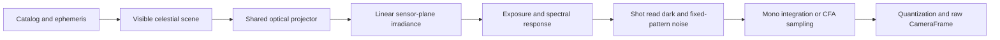

# Virtual Camera and Planetarium Validation

## Purpose

The virtual camera is the first production-quality `ICameraModule` used to
prove CameraAgent acquisition, exposure control, processing, storage, local UI,
and eventual upload. It must behave like a camera adapter, not like a separate
demo application.

The implementation combines three independent concerns:

1. Astronomy determines which objects are visible at a UTC instant and
   observatory location.
2. Optics project visible directions through a configured lens and camera
   orientation onto sensor coordinates.
3. Sensor simulation converts scene irradiance into mono or color raw pixels
   using exposure, gain, noise, and defect parameters.

Keeping these concerns separate lets CameraAgent and LogicHost reuse identical
projection and annotation behavior while physical camera modules replace only
the sensor-acquisition stage.

## Legacy Baseline

The commit-pinned source map is maintained in
[`reference-code.md`](reference-code.md). The relevant baseline behavior is:

- V5 defines synthetic and physical profiles for the monochrome ASI174MM and
  color ASI174MC, both using 1936 × 1216 IMX174 geometry and 5.86 µm pixels.
- V5 selects fisheye or rectilinear projection from the configured lens kind.
- V5 fisheye projection supports equidistant, equisolid-angle, orthographic,
  and stereographic radial mappings.
- V5 rectilinear projection supports perspective/gnomonic mapping derived from
  physical focal length and pixel pitch or from horizontal field of view.
- The V5 color mock renders color pixels with channel noise. Despite describing
  the noise as Bayer-like, it does not emit a Bayer color-filter-array mosaic.
- V6 retains useful shared imaging, projector-factory, and simulated starfield
  boundaries but does not add a working stacker.

These behaviors are requirements input, not code to copy unchanged.

## Virtual Camera Family

Implement one `VirtualSkyCameraModule` selected through the ordinary
`ICameraModuleFactory`. A validated sensor profile controls whether it behaves
as a monochrome or color camera. Named presets provide convenient ASI174-family
fixtures without hard-coding the renderer to one model.

Initial named profiles are:

| Profile | Geometry | Sensor response | Canonical raw output |
| --- | --- | --- | --- |
| `VirtualAsi174Mm` | 1936 × 1216, 5.86 µm | Monochrome | `Mono16` |
| `VirtualAsi174McRgb` | 1936 × 1216, 5.86 µm | Color scene compatibility | `Rgb24` |
| `VirtualAsi174McBayer` | 1936 × 1216, 5.86 µm | RGGB CFA sensor emulation | `BayerRggb16` |

`VirtualAsi174McBayer` is complete only after the shared frame contract can
describe CFA pattern, sample bit depth, packing, stride, endianness, black
level, white level, and channel gains. Until then, the RGB profile validates
color rendering but must not be described as raw ASI174MC emulation.

The implementation must not branch on preset names. Presets produce ordinary
sensor, optics, orientation, and simulation option records consumed through
the same interfaces as custom rigs.

## Sensor Pipeline

The renderer first produces a linear scene representation independent of the
destination sensor. A sensor response stage then creates the camera frame.

### Monochrome mode

- Accumulate stars, planets, background, and optional effects into a linear
  high-precision luminance buffer.
- Apply exposure, gain, vignetting, response curve, and configured noise.
- Quantize to unsigned 16-bit samples for `Mono16`.
- Do not apply display gamma, tone mapping, labels, or annotation to raw data.

### Color RGB compatibility mode

- Derive star color from catalog color index or a documented fallback.
- Render planets and background through a linear RGB scene buffer.
- Apply configurable per-channel response, white balance, and channel noise.
- Quantize to the explicitly documented `Rgb24` channel order.
- Treat RGB output as a convenient rendered camera format, not a CFA capture.

### Color CFA mode

- Sample the linear RGB sensor plane through the configured CFA pattern.
- Preserve one raw sample per photosite; do not demosaic inside the camera
  module.
- Record CFA pattern, black/white levels, channel gains, and sample layout in
  frame metadata.
- Implement demosaicing as an optional Imaging pipeline derivative so raw data
  remains available.

### Sensor parameters

Every physical-response value must include its source or be labeled as a
simulation parameter. Required configurable groups are:

- Exposure and gain bounds.
- ADC bit depth and saturation level.
- Black level and bias variation.
- Read noise, shot noise, dark current, and fixed-pattern noise.
- Per-channel spectral response and white balance for color profiles.
- Vignetting and lens transmission.
- Hot, dead, and stuck pixel maps.
- Readout duration and optional row/readout effects.
- Deterministic random seed.

The first milestone may use documented heuristic defaults. It must not present
them as measured IMX174 characteristics.

## Optical Profiles

The optical projector is created from rig configuration in
`HVO.SkyMonitor.Astronomy`. The virtual camera, local annotation pipeline, and
LogicHost derivative pipeline use the same projector factory and projection
context.

### Fisheye lenses

Required mappings are:

| Model | Radial relationship | Initial requirement |
| --- | --- | --- |
| Equidistant | $r = f\theta$ | Required |
| Equisolid angle | $r = 2f\sin(\theta/2)$ | Required |
| Orthographic | $r = f\sin(\theta)$ | Required |
| Stereographic | $r = 2f\tan(\theta/2)$ | Required |

Fisheye configuration includes:

- Horizontal and vertical field of view where known.
- Focal length and documented mapping model.
- Principal point $(c_x, c_y)$.
- Usable image-circle radius or calibrated edge mask.
- Optional radial calibration coefficients.
- Sensor crop and horizon mask.
- Boresight altitude/azimuth and camera roll.

Do not assume every fisheye follows the equidistant model. The Fujinon profile
is configurable because its exact installed mapping and usable circle should be
calibrated from real images.

### Rectilinear lenses and telescopes

“Rectangular” camera views are modeled as rectilinear/pinhole projection into a
rectangular sensor. Perspective and gnomonic names resolve to the same initial
projection family.

For camera ray $(X,Y,Z)$ with $Z > 0$:

$$
u = f_x\frac{X}{Z} + c_x, \qquad
v = -f_y\frac{Y}{Z} + c_y
$$

Intrinsics are preferably derived from physical focal length and pixel pitch:

$$
f_{px} = \frac{f_{mm}}{p_{mm/px}}
$$

The configuration may instead provide calibrated $f_x$, $f_y$, $c_x$, $c_y$
or a horizontal/vertical field of view. Explicit calibrated intrinsics take
precedence over derived values.

Required profiles include:

- A normal rectilinear photographic lens.
- A narrow-field telescope profile.
- Both mono and color sensor combinations.

### Shared optical configuration

The current single `FieldOfViewDegrees` rig value is insufficient. The Phase 0
contract revision must represent:

- A strongly typed projection model rather than an arbitrary string.
- Optional horizontal and vertical field of view.
- Focal length and sensor pixel pitch.
- Principal point and optional calibrated focal lengths in pixels.
- Lens kind: fisheye, rectilinear, or telescope.
- Projection calibration/version identifier.
- Distortion or radial calibration coefficients where applicable.
- Independent boresight and roll without duplicating roll in lens and rig data.

## Required Compatibility Matrix

The compatibility matrix tracks combinations that must run through ordinary
acquisition, preview, storage, and telemetry paths. Rows marked `Required` are
part of the first virtual-camera milestone; Bayer coverage follows the frame-
layout contract work described above.

| Sensor | Fisheye | Rectilinear | Telescope |
| --- | --- | --- | --- |
| Mono16 | Required | Required | Required |
| RGB24 color | Required | Required | Required |
| Bayer16 color | Planned after frame-layout contracts | Planned | Planned |

CI uses reduced dimensions with the same aspect ratio and optics. Full
1936 × 1216 profiles validate realistic memory, performance, and image output.

## Deterministic Fixture Manifest

Every generated golden or comparison image must have a machine-readable
manifest containing:

- Renderer, projection algorithm, and fixture version.
- UTC instant in ISO 8601 form.
- Latitude, longitude, elevation, and time-zone identifier.
- Pressure, temperature, and refraction mode if refraction is enabled.
- Catalog name, version, checksum, magnitude limit, and selection policy.
- Ephemeris implementation and version.
- Sensor dimensions, pixel size, response mode, format, and CFA pattern.
- Lens kind, mapping, focal length, fields of view, intrinsics, and principal
  point.
- Boresight altitude/azimuth, roll, flip, crop, and horizon mask.
- Exposure, gain, black/white levels, noise profile, and random seed.
- Expected visible object IDs and projected pixel coordinates.
- Pixel checksum for deterministic internal fixtures.

An image without this information is useful for visual inspiration but not as
a projection conformance fixture.

## Validation Strategy

### 1. Numeric astronomy validation

Before comparing images, validate time and coordinate calculations against
published reference cases and a trusted astronomy implementation. Tests cover
sidereal time, RA/Dec to Alt/Az, refraction policy, camera basis, forward and
inverse projection, field edges, and visibility rejection.

### 2. Shared projector conformance

For every fixture, the virtual renderer, CameraAgent annotations, and LogicHost
annotations must receive identical projected coordinates from the shared
Astronomy assembly. Tests compare object visibility and pixel positions within
a documented sub-pixel tolerance.

### 3. Synthetic geometry fixtures

Render known rays and artificial catalog points at the optical axis, cardinal
directions, field edges, horizon, and outside the field. These isolate lens math
from catalog and ephemeris errors.

### 4. External planetarium comparison

Use a trusted planetarium such as
[Stellarium](https://stellarium.org/) or
[Stellarium Web](https://stellarium-web.org/) to produce comparison views with
matching UTC, location, orientation, field of view, projection mode, refraction,
and magnitude limit.

External screenshots are visual/reference oracles, not byte-for-byte golden
images. Catalog versions, star rendering, atmospheric models, horizon handling,
and projection conventions differ. Validation should compare:

- Which bright named objects are visible.
- Relative orientation and field coverage.
- Pixel positions of selected reference stars and planets after accounting for
  projection and viewport conventions.
- Rotation over a known time interval.
- Fisheye radial placement and rectilinear angular scale.

Record the planetarium product/version and all settings in the fixture manifest.
Disable labels, landscape, atmosphere, and decorative rendering when measuring
geometry unless the specific comparison requires them.

Do not add arbitrary online images to the repository. Confirm license and
redistribution permission before storing third-party screenshots. Prefer a
scripted local Stellarium capture or store only measured coordinates and a URL
when redistribution is unclear.

### 5. Operator comparison system

After the first representative outputs exist, create a compact comparison pack:

1. Zenith fisheye, mono, night sky.
2. Zenith fisheye, color, same instant.
3. Low-altitude fisheye view exercising horizon and refraction.
4. Rectilinear 50 mm view centered on a recognizable star field.
5. Narrow telescope view with known bright objects.
6. Two frames separated by a known time interval.

Each output includes its manifest and a clean preview. These can be submitted
to the operator-provided compatible system. The returned comparison image or
object coordinates must be stored only with source, version, permissions, and
the exact input settings.

### 6. Real-camera calibration

Planetarium agreement validates the celestial model but not an installed lens.
Real camera images are ultimately required to solve principal point, rotation,
effective focal length, radial distortion, horizon mask, and optical
misalignment. Calibration values belong in a versioned rig profile so old
artifacts remain reproducible.

## Acceptance Criteria

- Mono and RGB color profiles produce deterministic images for identical input.
- Fisheye and rectilinear/telescope profiles use the same celestial scene and
  shared projector contracts.
- Changing sensor mode changes sensor response, not celestial geometry.
- Changing projection changes pixel placement according to its documented
  mapping without changing the underlying visible-object set except at field
  boundaries.
- Forward/inverse projection and external reference-object positions meet their
  documented tolerances.
- Renderer and annotation coordinates agree for every compatibility fixture.
- Raw outputs contain no labels or display tone mapping.
- Every checked-in fixture includes a complete manifest and source/license
  record.
- Full-resolution output stays within the measured CameraAgent memory and
  cadence budget on the target host.

## Implementation Order

1. Extend rig and frame-layout contracts for explicit optics and color layouts.
2. Implement shared fisheye and rectilinear projectors with numeric fixtures.
3. Implement the catalog/ephemeris scene independent of pixel format.
4. Implement deterministic linear mono rendering and `Mono16` sensor response.
5. Implement linear color rendering and `Rgb24` compatibility response.
6. Run the full lens/sensor compatibility matrix and external comparisons.
7. Add CFA formats and Bayer sampling before claiming raw ASI174MC fidelity.
8. Calibrate profiles against real cameras when suitable images are available.